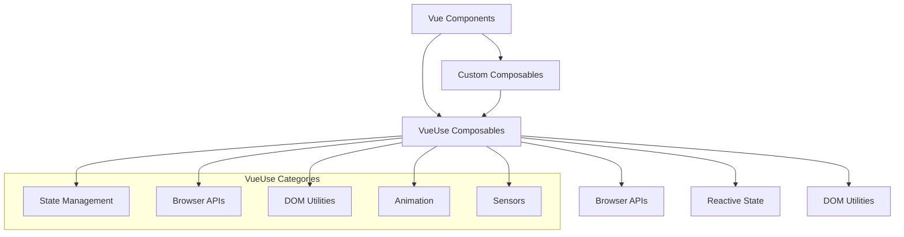

# Design Document

## Overview

This design outlines the migration strategy for replacing PrimeVue components with custom components while integrating VueUse composables throughout the FloowSynk Vue.js application. The migration will be performed incrementally to minimize disruption while improving code maintainability, reducing bundle size, and leveraging modern Vue 3 composition patterns.

Based on the current codebase analysis, the following PrimeVue components are currently in use:
- Button (PrimaryButton wrapper)
- InputText and FloatLabel (TextInput wrapper)
- Password and FloatLabel (PasswordInput wrapper)
- Tabs, TabList, Tab, TabPanels, TabPanel (Tab wrapper)
- Toolbar (Home view)
- Divider (Login view)
- Tooltip directive

## Architecture

### Migration Strategy

The migration will follow a **component-by-component replacement strategy** with the following phases:

1. **Preparation Phase**: Set up VueUse integration and create base composables
2. **Core Components Phase**: Replace fundamental UI components (buttons, inputs, layout)
3. **Complex Components Phase**: Replace advanced components (tabs, modals, tables)
4. **Integration Phase**: Update all consuming components and remove PrimeVue dependencies
5. **Optimization Phase**: Bundle size optimization and performance improvements

### VueUse Integration Architecture



## Components and Interfaces

### 1. Base Component System

#### Component Structure
Each custom component will follow the established pattern:
```
ComponentName/
├── ComponentName.vue           # Main component
├── ComponentName.styles.css    # Scoped styles
├── ComponentName.hooks.ts      # VueUse-based composables
├── ComponentName.types.ts      # TypeScript definitions
├── ComponentName.constants.ts  # Component constants
└── index.ts                   # Exports
```

#### Base Props Interface
```typescript
interface BaseComponentProps {
  id?: string
  class?: string | string[] | Record<string, boolean>
  style?: string | CSSProperties
  disabled?: boolean
  loading?: boolean
}
```

### 2. Custom Component Implementations

#### Button Component
**File**: `App/src/components/Composable/UI/Buttons/Button.vue`

**VueUse Integration**:
- `useElementSize` for responsive button sizing
- `useTimeoutFn` for loading states
- `useEventListener` for advanced click handling

**Props Interface**:
```typescript
interface ButtonProps extends BaseComponentProps {
  variant?: 'primary' | 'secondary' | 'outline' | 'ghost'
  size?: 'small' | 'medium' | 'large'
  icon?: Component
  iconPosition?: 'left' | 'right'
  loading?: boolean
  loadingText?: string
}
```

#### Input Components
**Files**: 
- `App/src/components/Composable/UI/Inputs/TextInput.vue`
- `App/src/components/Composable/UI/Inputs/PasswordInput.vue`

**VueUse Integration**:
- `useVModel` for v-model handling
- `useFocus` for focus management
- `useElementSize` for responsive inputs
- `useClipboard` for password input copy functionality
- `useToggle` for password visibility

**Props Interface**:
```typescript
interface InputProps extends BaseComponentProps {
  modelValue?: string
  label?: string
  placeholder?: string
  type?: 'text' | 'email' | 'password' | 'number'
  required?: boolean
  error?: string
  hint?: string
  readonly?: boolean
}
```

#### Tab Component
**File**: `App/src/components/Composable/UI/Tabs/Tabs.vue`

**VueUse Integration**:
- `useVModel` for active tab management
- `useResizeObserver` for responsive tab behavior
- `useElementSize` for tab container sizing
- `useSwipe` for mobile swipe navigation

**Props Interface**:
```typescript
interface TabsProps extends BaseComponentProps {
  modelValue?: string | number
  tabs: TabItem[]
  orientation?: 'horizontal' | vertical'
  variant?: 'default' | 'pills' | 'underline'
}

interface TabItem {
  id: string | number
  label: string
  icon?: Component
  content: Component | string
  disabled?: boolean
  closable?: boolean
}
```

#### Toolbar Component
**File**: `App/src/components/Composable/UI/Layout/Toolbar.vue`

**VueUse Integration**:
- `useElementSize` for responsive toolbar
- `useResizeObserver` for layout adjustments
- `useBreakpoints` for responsive behavior

#### Divider Component
**File**: `App/src/components/Composable/UI/Layout/Divider.vue`

**VueUse Integration**:
- `useElementSize` for responsive dividers
- `useIntersectionObserver` for animation triggers

### 3. Composable Architecture

#### Core Composables

**File**: `App/src/components/Composable/UI/composables/useTheme.ts`
```typescript
export function useTheme() {
  const isDark = usePreferredDark()
  const theme = useStorage('theme', 'auto')
  
  const currentTheme = computed(() => {
    if (theme.value === 'auto') {
      return isDark.value ? 'dark' : 'light'
    }
    return theme.value
  })
  
  return {
    theme,
    currentTheme,
    isDark: computed(() => currentTheme.value === 'dark'),
    toggleTheme: () => {
      theme.value = theme.value === 'light' ? 'dark' : 'light'
    }
  }
}
```

**File**: `App/src/components/Composable/UI/composables/useFormValidation.ts`
```typescript
export function useFormValidation<T extends Record<string, any>>(
  initialValues: T,
  rules: ValidationRules<T>
) {
  const values = reactive({ ...initialValues })
  const errors = reactive<Partial<Record<keyof T, string>>>({})
  const touched = reactive<Partial<Record<keyof T, boolean>>>({})
  
  const { pause, resume } = watchPausable(
    values,
    () => validateForm(),
    { deep: true }
  )
  
  // Implementation details...
  
  return {
    values,
    errors,
    touched,
    isValid: computed(() => Object.keys(errors).length === 0),
    validate: validateForm,
    reset: resetForm
  }
}
```

**File**: `App/src/components/Composable/UI/composables/useModal.ts`
```typescript
export function useModal() {
  const isOpen = ref(false)
  const { escape } = useMagicKeys()
  
  const open = () => {
    isOpen.value = true
    document.body.style.overflow = 'hidden'
  }
  
  const close = () => {
    isOpen.value = false
    document.body.style.overflow = ''
  }
  
  // Close on escape key
  whenever(escape, close)
  
  // Close on outside click
  const modalRef = ref<HTMLElement>()
  onClickOutside(modalRef, close)
  
  return {
    isOpen: readonly(isOpen),
    modalRef,
    open,
    close,
    toggle: useToggle(isOpen)
  }
}
```

## Data Models

### Theme Configuration
```typescript
interface ThemeConfig {
  colors: {
    primary: string
    secondary: string
    success: string
    warning: string
    error: string
    info: string
    background: string
    surface: string
    text: string
  }
  spacing: {
    xs: string
    sm: string
    md: string
    lg: string
    xl: string
  }
  borderRadius: {
    sm: string
    md: string
    lg: string
    full: string
  }
  shadows: {
    sm: string
    md: string
    lg: string
  }
}
```

### Component State Models
```typescript
interface ComponentState {
  loading: boolean
  disabled: boolean
  error: string | null
  focused: boolean
  hovered: boolean
}

interface FormFieldState extends ComponentState {
  value: any
  touched: boolean
  dirty: boolean
  valid: boolean
  validationMessage: string | null
}
```

## Error Handling

### Component Error Boundaries
Each custom component will implement error handling using VueUse composables:

```typescript
export function useComponentError() {
  const error = ref<Error | null>(null)
  const { pause, resume } = useTimeoutFn(() => {
    error.value = null
  }, 5000)
  
  const handleError = (err: Error) => {
    error.value = err
    console.error('Component Error:', err)
    resume()
  }
  
  return {
    error: readonly(error),
    hasError: computed(() => error.value !== null),
    handleError,
    clearError: () => {
      error.value = null
      pause()
    }
  }
}
```

### Validation Error Handling
Form validation errors will be managed through a centralized composable:

```typescript
export function useValidationErrors() {
  const errors = reactive<Record<string, string[]>>({})
  
  const setError = (field: string, message: string | string[]) => {
    errors[field] = Array.isArray(message) ? message : [message]
  }
  
  const clearError = (field: string) => {
    delete errors[field]
  }
  
  const clearAllErrors = () => {
    Object.keys(errors).forEach(key => delete errors[key])
  }
  
  return {
    errors: readonly(errors),
    hasErrors: computed(() => Object.keys(errors).length > 0),
    getError: (field: string) => errors[field]?.[0],
    setError,
    clearError,
    clearAllErrors
  }
}
```

## Testing Strategy

### Unit Testing Approach
1. **Component Testing**: Test each custom component in isolation
2. **Composable Testing**: Test VueUse integrations and custom composables
3. **Integration Testing**: Test component interactions and data flow
4. **Visual Regression Testing**: Ensure UI consistency after migration

### Testing Tools Integration
- **Vue Test Utils**: Component testing framework
- **Vitest**: Fast unit test runner
- **@vue/test-utils**: Vue 3 testing utilities
- **@testing-library/vue**: User-centric testing approach

### Test Structure Example
```typescript
// Button.test.ts
import { mount } from '@vue/test-utils'
import { describe, it, expect } from 'vitest'
import Button from './Button.vue'

describe('Button Component', () => {
  it('renders with correct props', () => {
    const wrapper = mount(Button, {
      props: {
        variant: 'primary',
        size: 'medium'
      }
    })
    
    expect(wrapper.classes()).toContain('btn-primary')
    expect(wrapper.classes()).toContain('btn-medium')
  })
  
  it('emits click event', async () => {
    const wrapper = mount(Button)
    await wrapper.trigger('click')
    
    expect(wrapper.emitted('click')).toBeTruthy()
  })
})
```

## Migration Timeline

### Phase 1: Foundation (Week 1)
- Set up VueUse integration
- Create base composables and utilities
- Establish component structure patterns
- Create theme system

### Phase 2: Core Components (Week 2-3)
- Replace Button components
- Replace Input components (TextInput, PasswordInput)
- Replace Layout components (Toolbar, Divider)
- Update consuming components

### Phase 3: Complex Components (Week 4)
- Replace Tab components
- Implement advanced composables
- Handle complex state management

### Phase 4: Integration & Cleanup (Week 5)
- Remove PrimeVue dependencies
- Update all imports and references
- Bundle size optimization
- Performance testing

### Phase 5: Testing & Documentation (Week 6)
- Comprehensive testing
- Documentation updates
- Code review and refinement